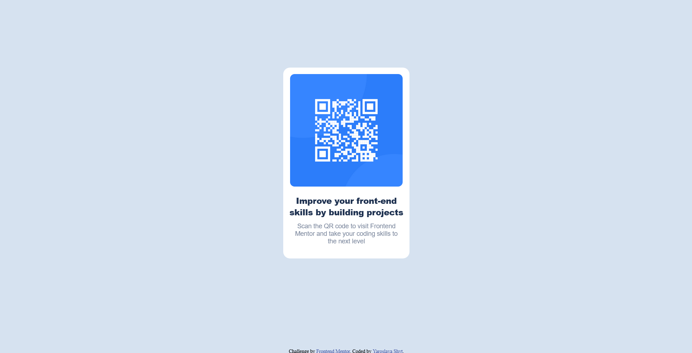

# Frontend Mentor - QR code component solution

This is a solution to the [QR code component challenge on Frontend Mentor](https://www.frontendmentor.io/challenges/qr-code-component-iux_sIO_H). 
Frontend Mentor challenges help you improve your coding skills by building realistic projects. 

## Table of contents

- [Overview](#overview)
- [Screenshot](#screenshot)
- [Links](#links)
- [Built with](#built-with)
- [What I learned](#what-i-learned)
- [Continued development](#continued-development)
- [Useful resources](#useful-resources)
- [Author](#author)


## Overview

The task was to create a QR code component, using starting materials (contents of the page, images)

### Screenshot




### Links

- Solution URL: [mysolution](https://github.com/YaroslavaShyt/FrontendMentor)
- Live Site URL: [result](https://yaroslavashyt.github.io/FrontendMentor/)

### Built with

- HTML5
- CSS 
### What I learned

- <div> sizing
- margins, paddings
- font styling
```html
<div class="card">
    
    <h3>Improve your front-end skills by building projects</h3>
    <p>Scan the QR code to visit Frontend Mentor and take your coding skills to the next level</p>
</div>
```
```css
.card{
    margin: auto;
    width: 280px;
    background-color: hsl(0, 0%, 100%);
    border-radius: 15px;
}

### Continued development
  
Advanced CSS
  
### Useful resources
  
- [https://www.example.com](https://www.w3schools.com/css/css_align.asp) - Helped to realize Horizontal & Vertical Align

## Author

- Website - [https://www.your-site.com](https://yaroslavashyt.github.io/CV/)
- Frontend Mentor - [@yourusername](https://www.frontendmentor.io/profile/yourusername)](https://www.frontendmentor.io/profile/YaroslavaShyt)

